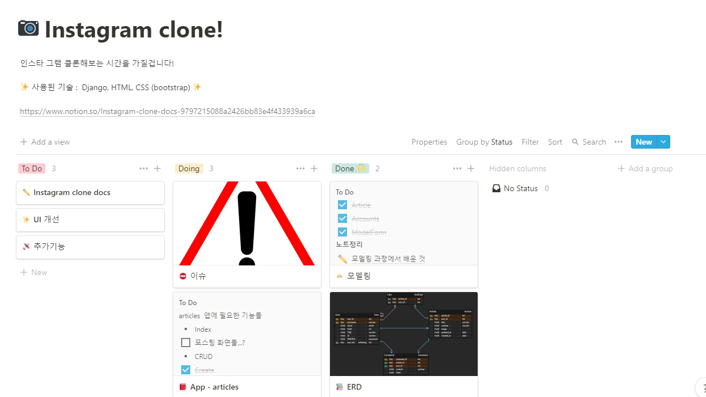

# 인스타그램 클론!




[노션Todo](https://www.notion.so/dcbbbafc4acb41509a71a0bcf696ca70?v=170db7d97e004dc6b077972ac500e2d2)


ERD

개발셋팅

모델링

- ERD에 맞게 modeling
- 모델에 맞춰 필요한 form 생성

articles 앱 

- index화면
- Create
- Read
- Update
- Delete
- 댓글쓰기
- 댓글삭제
- 댓글수정
- 좋아요 기능

accounts 앱

- 회원가입
- 로그인
- 로그아웃
- 내 페이지
- 회원정보수정
- 비번변경
- 회원탈퇴
- 팔로우/ 언팔로우

UI 개선


- ERD

- 개발 셋팅

  - 패키지다운

    ```python
    pip install Pillow pilkit django-imagekit
    ```

  - settings.py

    ```python
    #앱등록
    
    # STATIC
    STATICFILES_DIRS = [
        BASE_DIR / 'insta' /'static',
    ]
    
    # MEDIA files
    MEDIA_ROOT = BASE_DIR / 'media'
    MEDIA_URL = '/media/'
    
    AUTH_USER_MODEL='accounts.User'
    ```

  - urls.py

    ```python
    from django.conf import settings
    from django.conf.urls.static import static
    
    + static(settings.MEDIA_URL, document_root=settings.MEDIA_ROOT)
    ```

    

